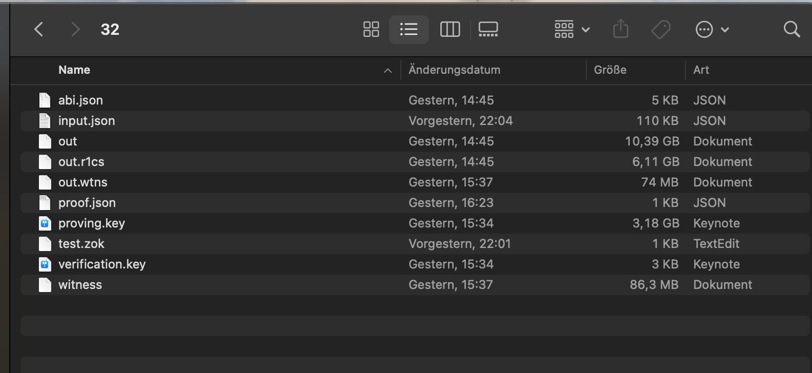

# Bachelor's Thesis: Privacy-Preserving Energy Compliance in Local Renewable Energy Markets

## Get Started
The ZoKrates stdlib and PyCrypto version of this repository are used from [this Bachelor Thesis](https://github.com/uZhW8Rgl/Bachelor-Thesis) and also included as src.

You need to export the custom ZoKrates version to your path and install the customized python PyCrypto package from `NestingZokrates/pycrypto`. This should work automatically with the `requirements.txt` file.

Python is used as a wrapper around the ZoKrates code to execute all commands.

### Setting up the environment
Begin by pulling the ba-private-compliance Docker image from Docker Hub:

```bash
docker pull mrberoxar/ba-private-compliance:latest
```
Or create an own image based on this project's Dockerfile:
```bash
docker build -t my-private-compliance .
```

To test everything works you can run one of the Test.py in /tests or check the precompiled compliance of compliance with src/proof_of_compliane/MockVerifier.py:

```bash
docker run -it --rm mrberoxar/ba-private-compliance:latest /bin/bash
cd tests/test_inner_proof
python TestInnerProof.py

```
Alternatively manually:

Export the custom ZoKrates version to your path with the following commands:

```bash
export PATH=$PATH:/Users/Desktop/NestingZokrates/ZoKrates/target/release/
export ZOKRATES_STDLIB=/Users/Desktop/NestingZokrates/ZoKrates/zokrates_stdlib/stdlib/
```

## Info
All ZoKrates compiled files and proving keys in src and evaluation have been deleted because they took up more than 100 GB of storage (In the Evaluation dir, for example, the outer proof's compiled circuit with 32 inner proofs had a size of around 17 GB and the proving key of around 3 GB, as shown in the picture below).



However, the `proof.json` and `verification.key` files can be used to check the proofs. Furthermore, the proof of concept has merely four inner proofs with two signatures each, so the whole system's computation (including setup, etc.) takes only around 15-20 minutes for the purpose of demonstrability and simplicity. But the parameters in generator files like the number of households and signatures can be changed to an arbitrary amount to reuse the implementation for larger proofs.

## Procedure

### Setup
- `src/generators/ZokCodeGenerator` generates the required ZoK code for the inner proofs and outer proof.
- `src/proof_of_compliance/SetupOuterProof` and `src/proof_of_compliance/inner_proofs/SetupInnerProofs` compile and set up the ZoK codes.

### Proof generation
- Run `src/proof_of_compliance/inner_proofs/GenerateBiWeeklyProofOfIntegrity` to generate the inner proofs, then `src/proof_of_compliance/GenerateProofOfCompliance` to generate the outer proof with the inner proofs as inputs.

### Proof Verification
- Use `src/proof_of_compliance/MockVerifier` to verify the outer proof.

### Helper
- A Jupyter notebook was used to create inner proofs files with custom values to test implementations quickly.

## Evaluation
Evaluation tests have output `.csv` files with the results. I recommend running them independently because some evaluation tests have runtime of a couple of hours.

## Test
Tests for the ZoK code are included as well.

## Commands
Commands I used to compute the ZoKrates proofs, if one wants to run things manually:

### Inner proof

```bash
zokrates compile -i inner_proof.zok -c bls12_377
zokrates setup -b ark -s gm17
zokrates compute-witness --abi --stdin < input.json
zokrates generate-proof -b ark -s gm17
zokrates verify
```

### Outer proof

```bash
zokrates compile --curve bw6_761 -i outer_proof.zok
zokrates setup --proving-scheme gm17 --backend ark 
zokrates compute-witness --abi --stdin < input.json
zokrates generate-proof --proving-scheme gm17 --backend ark
zokrates verify
```

### Create input.json for the outer proof (adjust for the number of inner proofs)

```bash
echo "[
    {
        \"proofs\": [
            $(cat household_1/proof.json | jq '{proof: .proof, inputs: .inputs}'),
            $(cat household_2/proof.json | jq '{proof: .proof, inputs: .inputs}')
        ],
        \"keys\": [
            $(cat household_1/verification.key | jq 'del(.scheme, .curve)'),
            $(cat household_2/verification.key | jq 'del(.scheme, .curve)')
        ]
    },
    \"THRESHOLD\"   
]" > input.json
```
